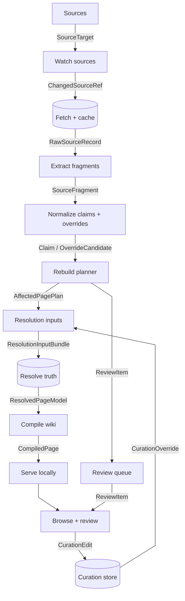

# Pipeline interfaces

First draft of the data contracts between the main wiki compiler components.

The goal is to make every arrow explicit without turning the architecture
diagram into a wall of labels. Names here are provisional, but they should be
stable enough to guide early code structure.

## Interface map



## Arrow contracts

Cardinality describes payload counts per run or work unit, not the number of
component instances.

| From | To | Interface | Cardinality | Persisted? | Purpose |
| --- | --- | --- | --- | --- | --- |
| Sources | Watch sources | `SourceTarget` | `1..n` | yes | Defines what can be watched or fetched. |
| Watch sources | Fetch + cache | `ChangedSourceRef` | `0..n` | yes | Says which source records need fetching. |
| Fetch + cache | Extract fragments | `RawSourceRecord` | `1..n` | yes | Stores exact source payloads with revision provenance. |
| Extract fragments | Normalize claims | `SourceFragment` | `0..n` per raw record | yes | Keeps source-shaped extracted pieces before normalization. |
| Normalize claims + overrides | Rebuild planner | `Claim` | `0..n` per fragment | yes | Normalized assertion derived from one or more fragments. |
| Normalize claims + overrides | Rebuild planner | `OverrideCandidate` | `0..n` per fragment | yes | Structured signal that a source may alter or invalidate other claims. |
| Rebuild planner | Resolution inputs | `AffectedPagePlan` | `0..n` | yes | Maps changed claims/entities to local pages needing work. |
| Rebuild planner | Review queue | `ReviewItem` | `0..n` | yes | Flags changed/conflicting/curated areas for human review. |
| Curation store | Resolution inputs | `CurationOverride` | `0..n` | yes | Manual truth, notes, suppressions, and forced decisions. |
| Resolution inputs | Resolve truth | `ResolutionInputBundle` | `1` per work unit | maybe | Claims, override candidates, curation, rules, and dependency context for one work unit. |
| Resolve truth | Compile wiki | `ResolvedPageModel` | `1..n` | yes | Final page-ready truth with provenance and uncertainty. |
| Compile wiki | Serve locally | `CompiledPage` | `1..n` | yes | Rendered page output, assets, and search/index entries. |
| Browse + review | Curation store | `CurationEdit` | `0..n` | yes | User edit from the local wiki UI before validation/normalization. |

## Core contracts

### `SourceTarget`

Defines an upstream or local source that can be watched and fetched.

```yaml
source_id: calamity_wiki
source_kind: mediawiki
authority_tier: mod_official
base_url: https://calamitymod.wiki.gg
api_url: https://calamitymod.wiki.gg/api.php
watch_strategy: mediawiki_recent_changes
fetch_strategy: mediawiki_revision
enabled: true
```

### `ChangedSourceRef`

Small update signal produced before fetching full content.

```yaml
source_id: calamity_wiki
source_record_id: calamity_wiki:page:The Devourer of Gods
record_kind: wiki_page
title: The Devourer of Gods
old_revision_id: 123450
new_revision_id: 123456
changed_at: 2026-07-02T15:19:04Z
change_reason: revision_changed
```

### `RawSourceRecord`

Exact fetched source payload plus provenance.

```yaml
source_record_id: calamity_wiki:page:The Devourer of Gods
source_id: calamity_wiki
record_kind: wiki_page
title: The Devourer of Gods
revision_id: 123456
fetched_at: 2026-07-02T15:21:00Z
content_type: wikitext
content_sha256: "..."
raw_payload_ref: cache/calamity_wiki/pages/The_Devourer_of_Gods/123456.wikitext
metadata:
  page_id: 315
  categories:
    - Boss NPCs
    - Enemy NPCs
```

### `SourceFragment`

Extracted source-shaped piece. A fragment should stay close to the upstream
structure and should not claim final truth.

```yaml
fragment_id: frag_01J...
source_record_id: calamity_wiki:page:The Devourer of Gods
source_id: calamity_wiki
page_title: The Devourer of Gods
page_kind: boss
fragment_kind: npc_infobox
path: infobox.life
raw_value: "{{dv|750,000|1,200,000|1,440,000|1,530,000|1,836,000}}"
normalized_text: "750,000 / 1,200,000 / 1,440,000 / 1,530,000 / 1,836,000"
provenance:
  revision_id: 123456
  section: infobox
```

### `Claim`

Normalized assertion derived from one or more fragments. Claims may still be
wrong, stale, conditional, or later overridden.

```yaml
claim_id: claim_01J...
claim_kind: npc_stat
subject:
  entity_ref: calamity_wiki:npc:The Devourer of Gods
  entity_kind: boss
predicate: max_life
value:
  normal: 750000
  expert: 1200000
  revengeance: 1440000
  death: 1530000
  boss_rush: 1836000
conditions:
  difficulty_modes:
    - normal
    - expert
    - revengeance
    - death
    - boss_rush
evidence:
  fragments:
    - frag_01J...
confidence: source_extracted
```

### `OverrideCandidate`

Structured signal that a source changes how other claims should be interpreted.
This is especially important for indirect overrides expressed in prose. LLM use
should mainly produce records like this, not final resolved truth.

```yaml
override_id: override_01J...
override_kind: replaces_behavior
target:
  entity_ref: calamity_wiki:npc:The Devourer of Gods
  entity_kind: boss
affected_claim_kinds:
  - boss_behavior
  - boss_phase
  - boss_strategy
conditions:
  enabled_mods:
    - infernum
evidence:
  fragments:
    - frag_01J...
classifier:
  kind: llm
  confidence: medium
status: candidate
```

### `AffectedPagePlan`

Planner output that says which local pages need resolution/compilation work.

```yaml
plan_id: plan_01J...
trigger:
  changed_claim_ids:
    - claim_01J...
affected_entities:
  - entity_ref: calamity_wiki:npc:The Devourer of Gods
    entity_kind: boss
affected_pages:
  - local_page_id: boss:the_devourer_of_gods
    page_kind: boss
    action: re_resolve_and_recompile
review_required: false
reason: source_claim_changed
```

### `ReviewItem`

Human review work generated by the rebuild planner.

```yaml
review_item_id: review_01J...
local_page_id: boss:the_devourer_of_gods
status: open
severity: medium
reason: changed_claim_touches_curated_topic
changed_claim_ids:
  - claim_01J...
curation_refs:
  - curation_01J...
suggested_action: inspect_and_keep_or_update_override
```

### `CurationEdit`

Raw edit submitted from the local wiki UI.

```yaml
edit_id: edit_01J...
local_page_id: boss:the_devourer_of_gods
user: local
created_at: 2026-07-02T16:00:00Z
edit_kind: override_claim
target_claim_kind: boss_behavior
body: "Infernum replaces this phase behavior; prefer Infernum source."
```

### `CurationOverride`

Validated durable curation input consumed by the resolver.

```yaml
curation_id: curation_01J...
local_page_id: boss:the_devourer_of_gods
scope:
  entity_ref: calamity_wiki:npc:The Devourer of Gods
  claim_kind: boss_behavior
override_kind: prefer_source
preferred_source_id: infernum_wiki
reason: Infernum behavior supersedes base Calamity in this modpack.
created_from_edit_id: edit_01J...
active: true
```

### `ResolutionInputBundle`

Work packet passed into resolution for one entity/page group.

```yaml
bundle_id: bundle_01J...
local_page_id: boss:the_devourer_of_gods
page_kind: boss
entity_refs:
  - calamity_wiki:npc:The Devourer of Gods
claim_ids:
  - claim_01J...
override_ids:
  - override_01J...
curation_ids:
  - curation_01J...
ruleset_id: infernal_eclipse_default
```

### `ResolvedPageModel`

Compiler input: the resolved page data with provenance attached.

```yaml
local_page_id: boss:the_devourer_of_gods
page_kind: boss
title: The Devourer of Gods
resolved_at: 2026-07-02T16:05:00Z
sections:
  - section_id: overview
    status: resolved
    content_model: prose
    claims:
      - resolved_claim_01J...
  - section_id: stats
    status: resolved
    content_model: stat_table
    claims:
      - resolved_claim_01J...
conflicts:
  open: []
  resolved:
    - conflict_01J...
provenance_summary:
  sources:
    - calamity_wiki
    - infernum_wiki
  curation_ids:
    - curation_01J...
```

### `CompiledPage`

Static/browser-facing output. This should be reproducible from
`ResolvedPageModel` plus templates/assets.

```yaml
local_page_id: boss:the_devourer_of_gods
route: /bosses/the-devourer-of-gods/
html_ref: public/bosses/the-devourer-of-gods/index.html
asset_refs:
  - public/assets/bosses/devourer.png
search_doc_ref: public/search/docs/boss_the_devourer_of_gods.json
compiled_at: 2026-07-02T16:06:00Z
source_model_hash: "..."
```

## Persistence boundaries

- Store `SourceTarget`, `ChangedSourceRef`, `RawSourceRecord`,
  `SourceFragment`, `Claim`, `OverrideCandidate`, `AffectedPagePlan`, `ReviewItem`,
  `CurationOverride`, `ResolvedPageModel`, and `CompiledPage`.
- `ResolutionInputBundle` can be rebuilt from persisted claims, override
  candidates, plans, curation, and rules, so it can start as transient.
- `CurationEdit` should be stored at least as an audit log if curation happens
  through the local website.
- Raw source payloads should be immutable by source revision.
- Compiled pages are disposable build outputs.

## Naming notes

- Prefer `fragment` over `chunk` for extracted source pieces. `chunk` is likely
  to mean text split for search or LLM context later.
- Use `claim` for normalized assertions that the resolver can compare,
  override, or reject.
- Use `effect_candidate` for normalized override signals that may modify,
  invalidate, or lower-priority other claims.
- Use `resolved_claim` only after authority rules and curation have been applied.
