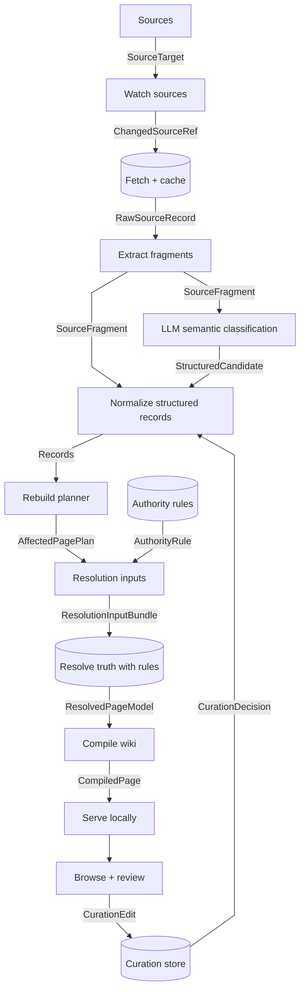

# Pipeline interfaces

## Pipeline Map



## Boundary Contracts

| From | To | Interface | Persisted? | Purpose |
| --- | --- | --- | --- | --- |
| Sources | Watch sources | `SourceTarget` | yes | Defines what can be watched or fetched. |
| Watch sources | Fetch + cache | `ChangedSourceRef` | yes | Says which source records need fetching. |
| Fetch + cache | Extract fragments | `RawSourceRecord` | yes | Stores exact source payloads with revision provenance. |
| Extract fragments | Normalize structured records | `SourceFragment` | yes | Keeps source-shaped extracted pieces before normalization. |
| Extract fragments | LLM semantic classification | `SourceFragment` | maybe | Provides prose, tables, and source-shaped fragments for LLM-assisted semantic classification. |
| LLM semantic classification | Normalize structured records | `StructuredCandidate` | yes | Candidate claim, classification, condition, or effect extracted from messy source text. |
| Curation store | Normalize structured records | `CurationDecision` | yes | Human review decisions that accept, correct, reject, or pin generated candidates before they become trusted records. |
| Normalize structured records | Rebuild planner | `Claim` | yes | Normalized assertion derived from one or more fragments or candidates. |
| Normalize structured records | Rebuild planner | `Classification` | yes | Entity, page-kind, fact-kind, condition, or source-context label used by resolver rules. |
| Normalize structured records | Rebuild planner | `EffectCandidate` | yes | Structured signal that a source may add, remove, move, qualify, or replace a specific claim. |
| Rebuild planner | Resolution inputs | `AffectedPagePlan` | yes | Maps changed claims/entities to local pages needing work. |
| Authority rules | Resolution inputs | `AuthorityRule` | yes | Hard source hierarchy and fact-scope rules used by deterministic resolution. |
| Resolution inputs | Resolve truth | `ResolutionInputBundle` | maybe | Claims, classifications, effect candidates, authority rules, and dependency context for one resolver work unit. |
| Resolve truth | Compile wiki | `ResolvedPageModel` | yes | Final page-ready truth with provenance and uncertainty. |
| Compile wiki | Serve locally | `CompiledPage` | yes | Rendered page output, assets, and search/index entries. |
| Browse + review | Curation store | `CurationEdit` | yes | User edit from the local wiki UI before validation/normalization. |

## Core contracts

The shapes below are draft interface examples, not locked schemas. Expect them
to change as real vertical slices expose missing fields, redundant fields, and
unclear boundaries between contracts.

### `SourceTarget`

Defines an upstream or local source that can be watched and fetched.

```yaml
source_id: infernum_wiki
source_kind: mediawiki
authority_tier: overhaul_official
source_layer: overhaul
built_on_source_ids:
  - calamity_wiki
base_url: https://infernummod.wiki.gg
api_url: https://infernummod.wiki.gg/api.php
watch_strategy: mediawiki_recent_changes
fetch_strategy: mediawiki_revision
authority_scopes:
  - boss_behavior
  - boss_phase
  - infernum_mode
enabled: true
```

### `ChangedSourceRef`

Small update signal produced before fetching full content.

```yaml
source_id: calamity_wiki
source_record_id: calamity_wiki:page:The Devourer of Gods
record_kind: wiki_page
title: The Devourer of Gods
old_revision_id: 123450
new_revision_id: 123456
changed_at: 2026-07-02T15:19:04Z
change_reason: revision_changed
```

### `RawSourceRecord`

Exact fetched source payload plus provenance.

```yaml
source_record_id: calamity_wiki:page:The Devourer of Gods
source_id: calamity_wiki
record_kind: wiki_page
title: The Devourer of Gods
revision_id: 123456
fetched_at: 2026-07-02T15:21:00Z
content_type: wikitext
content_sha256: "..."
raw_payload_ref: cache/calamity_wiki/pages/The_Devourer_of_Gods/123456.wikitext
metadata:
  page_id: 315
  categories:
    - Boss NPCs
    - Enemy NPCs
```

### `SourceFragment`

Extracted source-shaped piece. A fragment should stay close to the upstream
structure and should not claim final truth.

```yaml
fragment_id: frag_01J...
source_record_id: calamity_wiki:page:The Devourer of Gods
source_id: calamity_wiki
page_title: The Devourer of Gods
page_kind: boss
fragment_kind: npc_infobox
path: infobox.life
raw_value: "{{dv|750,000|1,200,000|1,440,000|1,530,000|1,836,000}}"
normalized_text: "750,000 / 1,200,000 / 1,440,000 / 1,530,000 / 1,836,000"
provenance:
  revision_id: 123456
  section: infobox
```

### `Claim`

Normalized assertion derived from one or more fragments. Claims may still be
wrong, stale, conditional, or later overridden.

```yaml
claim_id: claim_01J...
claim_kind: npc_stat
subject:
  entity_ref: calamity_wiki:npc:The Devourer of Gods
  entity_kind: boss
predicate: max_life
value:
  normal: 750000
  expert: 1200000
  revengeance: 1440000
  death: 1530000
  boss_rush: 1836000
conditions:
  difficulty_modes:
    - normal
    - expert
    - revengeance
    - death
    - boss_rush
evidence:
  fragments:
    - frag_01J...
confidence: source_extracted
```

### `Classification`

Normalized label used by resolver rules. Classifications make authority rules
simple by saying what a claim is about and when it applies.

```yaml
classification_id: class_01J...
subject:
  entity_ref: calamity_wiki:npc:The Devourer of Gods
  entity_kind: boss
labels:
  page_kind:
    - boss
    - enemy_npc
  fact_scope:
    - boss_behavior
    - infernum_mode
conditions:
  enabled_mods:
    - calamity
    - infernum
evidence:
  fragments:
    - frag_01J...
classifier:
  kind: deterministic
  confidence: high
```

### `StructuredCandidate`

Unvalidated structured output from deterministic parsers or LLM-assisted
semantic extraction. Candidates are not final truth. Normalization code should
validate, split, merge, or reject them before they become claims,
classifications, or effect candidates.

```yaml
candidate_id: cand_01J...
candidate_kind: claim
subject_hint: The Devourer of Gods
fact_scope: boss_behavior
conditions:
  enabled_mods:
    - infernum
raw_value: "Infernum changes the fight behavior."
evidence:
  fragments:
    - frag_01J...
extractor:
  kind: llm
  confidence: medium
status: candidate
```

### `EffectCandidate`

Structured signal that a source may add, remove, move, qualify, or replace a
specific claim. This is especially important for indirect effects expressed in
prose. LLM use may produce records like this, but not final resolved truth.

```yaml
effect_id: effect_01J...
effect_kind: replaces_behavior
target:
  entity_ref: calamity_wiki:npc:The Devourer of Gods
  entity_kind: boss
affected_claim_kinds:
  - boss_behavior
  - boss_phase
  - boss_strategy
conditions:
  enabled_mods:
    - infernum
evidence:
  fragments:
    - frag_01J...
classifier:
  kind: llm
  confidence: medium
status: candidate
```

### `AuthorityRule`

Scoped resolver rule. These rules are intentionally simple when claims,
classifications, and source hierarchy are precise. Most rules should express a
one-way source stack, not mutual mod patching.

```yaml
rule_id: infernum_boss_behavior_priority
claim_scope: boss_behavior
when:
  enabled_mods:
    - infernum
prefer_source_id: infernum_wiki
over_source_ids:
  - calamity_wiki
relationship: built_on
reason: Infernum-specific boss behavior applies when Infernum is enabled.
```

### `AffectedPagePlan`

Planner output that says which local pages need resolution/compilation work.

```yaml
plan_id: plan_01J...
trigger:
  changed_claim_ids:
    - claim_01J...
affected_entities:
  - entity_ref: calamity_wiki:npc:The Devourer of Gods
    entity_kind: boss
affected_pages:
  - local_page_id: boss:the_devourer_of_gods
    page_kind: boss
    action: re_resolve_and_recompile
reason: source_claim_changed
```

### `CurationEdit`

Raw edit submitted from the local wiki UI.

```yaml
edit_id: edit_01J...
local_page_id: boss:the_devourer_of_gods
user: local
created_at: 2026-07-02T16:00:00Z
edit_kind: correct_candidate
target_candidate_id: cand_01J...
body: "This is an Infernum-only boss behavior claim, not generic Calamity behavior."
```

### `CurationDecision`

Validated durable curation input consumed during normalization. Most curation
decisions control generated structure: accepting, editing, rejecting, or pinning
LLM-produced candidates before they become trusted claims, classifications, or
effect candidates.

```yaml
curation_id: curation_01J...
local_page_id: boss:the_devourer_of_gods
decision_kind: correct_candidate
target:
  candidate_id: cand_01J...
reviewed_output:
  candidate_kind: classification
  fact_scope: boss_behavior
  conditions:
    enabled_mods:
      - infernum
reason: The source text describes Infernum behavior only.
created_from_edit_id: edit_01J...
active: true
```

### `ResolutionInputBundle`

Work packet passed into resolution for one entity/page group.

```yaml
bundle_id: bundle_01J...
local_page_id: boss:the_devourer_of_gods
page_kind: boss
entity_refs:
  - calamity_wiki:npc:The Devourer of Gods
claim_ids:
  - claim_01J...
classification_ids:
  - class_01J...
effect_ids:
  - effect_01J...
authority_rule_ids:
  - infernum_boss_behavior_priority
ruleset_id: infernal_eclipse_default
```

### `ResolvedPageModel`

Compiler input: the resolved page data with provenance attached.

```yaml
local_page_id: boss:the_devourer_of_gods
page_kind: boss
title: The Devourer of Gods
resolved_at: 2026-07-02T16:05:00Z
sections:
  - section_id: overview
    status: resolved
    content_model: prose
    claims:
      - resolved_claim_01J...
  - section_id: stats
    status: resolved
    content_model: stat_table
    claims:
      - resolved_claim_01J...
conflicts:
  open: []
  resolved:
    - conflict_01J...
provenance_summary:
  sources:
    - calamity_wiki
    - infernum_wiki
  review_decision_ids:
    - curation_01J...
```

### `CompiledPage`

Static/browser-facing output. This should be reproducible from
`ResolvedPageModel` plus templates/assets.

```yaml
local_page_id: boss:the_devourer_of_gods
route: /bosses/the-devourer-of-gods/
html_ref: public/bosses/the-devourer-of-gods/index.html
asset_refs:
  - public/assets/bosses/devourer.png
search_doc_ref: public/search/docs/boss_the_devourer_of_gods.json
compiled_at: 2026-07-02T16:06:00Z
source_model_hash: "..."
```

## Persistence boundaries

- Store `SourceTarget`, `ChangedSourceRef`, `RawSourceRecord`,
  `SourceFragment`, `StructuredCandidate`, `Claim`, `Classification`,
  `EffectCandidate`, `AuthorityRule`, `AffectedPagePlan`, `CurationDecision`,
  `ResolvedPageModel`, and `CompiledPage`.
- `ResolutionInputBundle` can be rebuilt from persisted claims,
  classifications, effect candidates, plans, and rules, so it can
  start as transient.
- `CurationEdit` should be stored at least as an audit log if candidate review
  or local curation happens through the local website.
- Raw source payloads should be immutable by source revision.
- Compiled pages are disposable build outputs.

## Naming notes

- Prefer `fragment` over `chunk` for extracted source pieces. `chunk` is likely
  to mean text split for search or LLM context later.
- Use `claim` for normalized assertions that the resolver can compare, rank, or
  reject.
- Use `classification` for labels that make scoped authority rules simple.
- Use `effect_candidate` for normalized signals that may add, remove, move,
  qualify, modify, invalidate, or lower-priority specific claims.
- Use `curation_decision` for human review of generated candidates, corrected
  classifications, suppressions, and pinned decisions.
- Use `resolved_claim` only after authority rules have been applied to normalized
  records.
