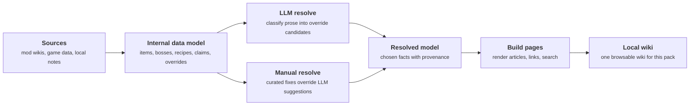

# Modpack wiki compiler showcase

Most modded game wikis explain one mod at a time.

A large modpack is different. Mods overwrite each other, difficulty modes change
bosses, recipes move around, progression gets reshuffled, and old wiki pages may
no longer match the game you are actually playing.

This project builds a local wiki for the final modpack, not for each separate
mod.

## The simple idea

Instead of reading five different wiki pages and guessing which one is still
true, the compiler produces one resolved page that says what is true in the
installed pack.

The important middle step is the internal data representation. Source pages are
not pasted directly into the final wiki. They are first turned into structured
records: items, bosses, recipes, drops, shops, progression gates, strategy
claims, override candidates, source links, and local corrections.

That gives the system something it can compare and resolve before writing a
human-readable page. Resolving and building are separate jobs: resolving decides
what is true, while building turns the resolved result into wiki pages.

## What the compiler actually does

The compiler takes messy source material and turns it into a pack-specific
knowledge model.

For example, one item might collect:

- its name, source mod, type, rarity, and stats
- how it is crafted, dropped, bought, or unlocked
- what other items use it
- which wiki or data export each fact came from
- whether a modpack note overrides the normal source wiki

Once facts are represented this way, the system can do useful merge work:

- notice that two sources describe the same thing
- prefer the source that matches the active overhaul or modpack
- keep manual corrections separate from scraped text
- show uncertainty instead of pretending every source agrees
- generate a normal wiki page from the resolved result

Resolution has two paths.

LLM resolve is mainly a classifier for messy context. It reads prose, strategy
advice, boss behavior descriptions, and mod notes, then turns implied changes
into structured override candidates such as `replaces_behavior`,
`disables_recipe`, `moves_progression`, or `overrides_ai`.

Those override candidates are inputs to the resolver. The LLM should not
directly decide final truth or write the final wiki page.

Manual resolve is where local truth is locked in by the player or maintainer.
Manual decisions override LLM suggestions and are important for pack-specific
corrections, disputed facts, and cases where the generated answer needs human
review.

## Example

If a boss exists in Calamity, is changed by Infernum, and has extra pack-specific
notes, the generated page should not dump all three versions together.

It should answer:

- how the boss works in this pack
- when the boss is fought in this pack
- what the boss drops in this pack
- which strategies and gear are actually available at that point
- where the answer came from when it matters

The player gets a normal wiki page. The system keeps the messy source history
behind the page.

## What it feels like to use

Open the local wiki and search for an item, boss, NPC, recipe, biome, class
setup, or progression step.

The page should read like a clean wiki article, but with modpack-aware answers:

- recipes reflect the pack's actual recipe changes
- boss behavior prefers the active overhaul or difficulty mode
- gear recommendations respect real progression availability
- shops, drops, and crafting paths point to the pack's final rules
- uncertain or manually corrected details are visible when needed

## Why this is useful

Normal wiki reading asks the player to do the merge work manually:

1. Find the vanilla page.
2. Find the mod page.
3. Check the difficulty overhaul page.
4. Check the modpack wiki or Discord note.
5. Guess which one wins.

This project moves that work into a repeatable local build.

The result is a browsable wiki that is specific to one modpack and more useful
than a stack of generic source wikis.

## The core promise

For any page, the wiki should answer one question first:

> What is true in this specific modpack?

Everything else exists to support that answer.
